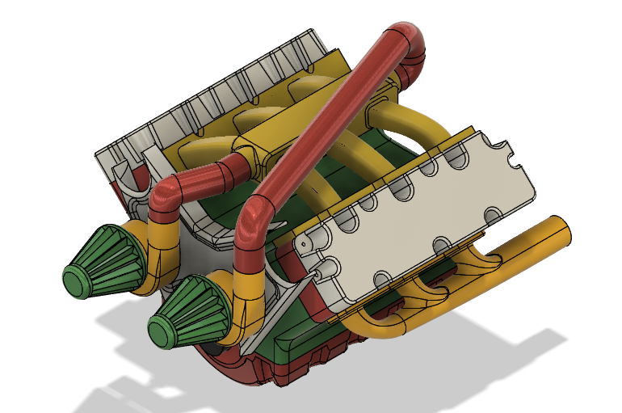
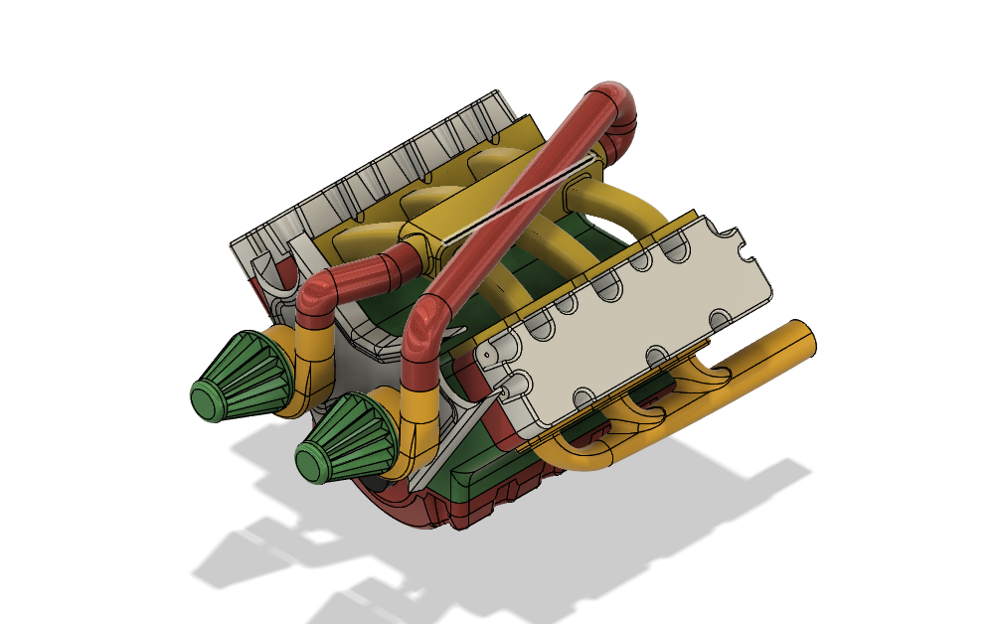
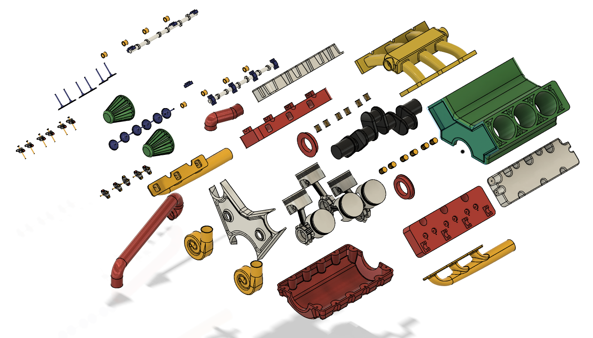
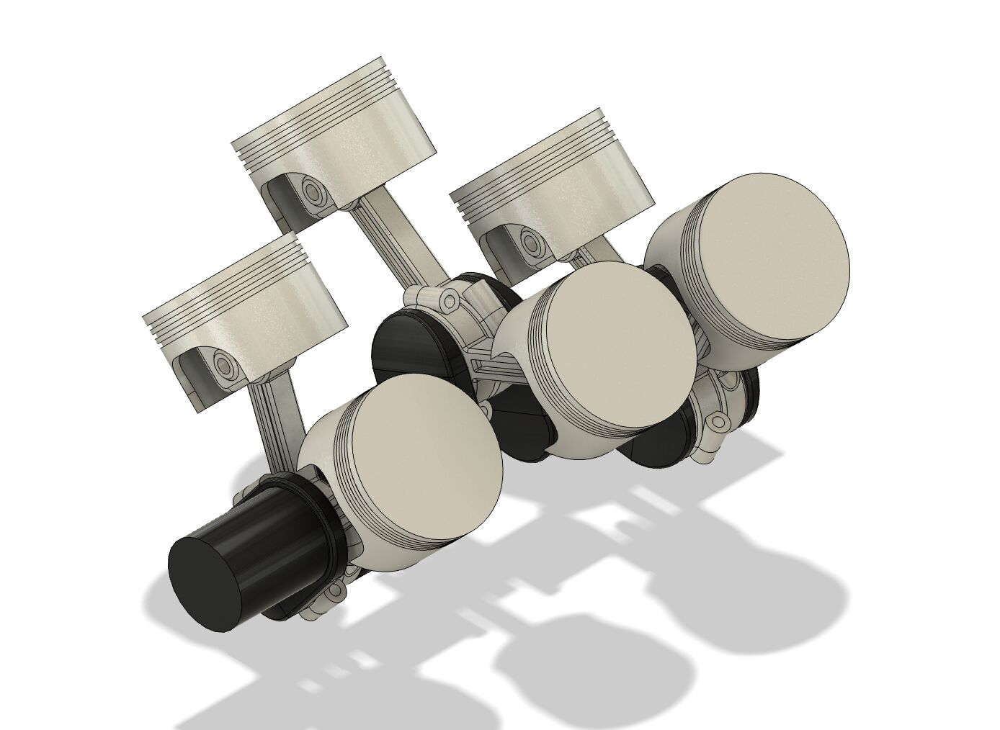

# V6 Engine CAD Assembly

A mechanical CAD assembly project created in **Autodesk Fusion 360** to improve my understanding of engine component relationships, assembly structure, and mechanical motion.

## Project Overview

This V6 engine was recreated and redesigned as a learning project based on a YouTube reference video.

The purpose of the project was not to develop an original engine architecture, but to practice complex mechanical modelling, organize a multi-component assembly, and better understand how individual engine components work together as a complete system.

## Software

- Autodesk Fusion 360

## Complete Assembly

### Front View

### Rear View

## Exploded View

The exploded view shows the relationship and positioning of the major components within the complete engine assembly.

## Major Components

The assembly includes components such as:

- Engine Block
- Crankshaft
- Pistons
- Camshaft
- Intake Valves
- Rocker Arms
- Cylinder Heads
- Intake Manifold
- Exhaust Manifolds
- Valve Covers
- Oil Pan
- Bushings
- Springs
- Side Cover
- Air Turbo Components
- Air Filter
- Hoses
- Supporting Components

## Crankshaft and Piston Mechanism

One of the main areas I focused on was the relationship between the crankshaft and pistons.

The assembly is configured so that crankshaft rotation produces reciprocating piston motion, helping visualize the conversion between rotational and linear mechanical motion.

## Fusion 360 Assembly Structure

The Fusion 360 component browser shows how the different parts and subassemblies are organized within the project.

## Motion Demonstration

The assembly includes a motion study where crankshaft rotation produces reciprocating piston movement.

▶️ [Watch the crankshaft and piston motion](motion/crankshaft_pistons_motion.mp4)

## What I Learned

Through this project, I improved my understanding of:

- Multi-component mechanical assemblies
- Component organization in Fusion 360
- Mechanical relationships between engine parts
- Crankshaft and piston motion
- Exploded assembly presentation
- Complex CAD modelling workflow
- Managing a larger Fusion 360 project

## Technical Documentation

More detailed notes about the modelling process, assembly development, and learning outcomes are available here:

[View Design Notes](documentation/design-notes.md)

## Project Attribution

This project was created for **educational and CAD practice purposes** using a YouTube video as a modelling reference.

The original V6 engine concept and reference design are not my own. The CAD recreation, assembly work, component organization, and learning process presented in this repository represent my own project work.

## Author

**Siam Ibne Sarwar (Sinan)**
Mechanical Design · Robotics · Hardware Integration

## Reference

This project was recreated and redesigned for educational and CAD practice purposes using a YouTube video as a modelling reference.

Reference video: [V6 Engine CAD Modelling Reference](https://youtu.be/HFgA1k3GR6E?si=uMbqexxWXmb562Iy)
